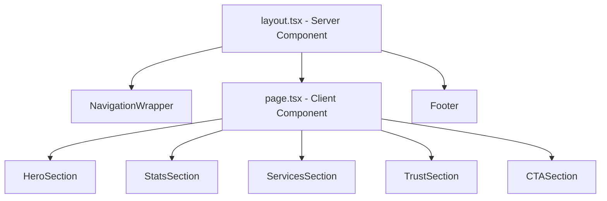

# Design Document: Home Page UI Redesign

## Overview

This document describes the technical design for the TIMS home page UI redesign. The goal is to elevate the visual quality of `src/app/page.tsx` and its associated `page.module.css`, improve accessibility and responsiveness, and enforce design system consistency — without touching the Next.js routing, data layer, or any other page.

The redesign is purely a front-end concern: component structure, CSS module rules, and Next.js image handling. No new routes, API endpoints, or third-party libraries are introduced.

### Key Constraints from Next.js 16

This project uses **Next.js 16.2.4**, which has breaking changes relevant to this feature:

- The `priority` prop on `<Image>` is **deprecated**. Use `preload={true}` instead for above-the-fold images.
- The `qualities` array is **required** in `next.config.ts` when using the Image Optimization API. Without it, Next.js 16 returns a 400 error for quality values not in the allowlist.
- External image URLs (e.g., Unsplash) require explicit `remotePatterns` configuration in `next.config.ts`.
- `onLoadingComplete` is deprecated — use `onLoad` instead.

---

## Architecture

The redesign touches exactly three files in the existing codebase, plus `next.config.ts` for image configuration:

```
src/app/
  page.tsx          ← Component structure, section markup, animation logic
  page.module.css   ← All section-level styles, responsive rules, animations
  globals.css       ← Any new CSS custom properties added to the design system

next.config.ts      ← remotePatterns + qualities config for next/image
```

No new files are created. No new components are extracted (the page is self-contained and the sections are not reused elsewhere). The Navbar and Footer components are unchanged.

### Rendering Model

`page.tsx` is a **Client Component** (`'use client'`) because it uses `useEffect` for the scroll-triggered animation on the Stats section (IntersectionObserver). This is consistent with the existing file.



---

## Components and Interfaces

All sections live inline in `page.tsx` as JSX blocks within the single `Home` default export. There are no sub-components to extract for this feature.

### Section Inventory

| Section | CSS Class Root | Key Elements |
|---|---|---|
| Hero | `heroWrapper` | `<section>`, `<h1>`, `<p>`, 2× `<Link>`, scroll chevron |
| Stats | `statsSection` | `<section>`, 4× stat card `<div>` |
| Services | `servicesSection` | `<section>`, 3× `<Link>` cards with `<Image fill>` |
| Trust | `trustSection` | `<section>`, 3× value prop items, `<Image>`, pull-quote |
| CTA | `ctaSection` | `<section>`, `<h2>`, `<p>`, `<Link>` button |

### Scroll Animation Hook

The Stats section requires an IntersectionObserver to trigger staggered fade-in animations. This is implemented with a `useEffect` inside `page.tsx`:

```tsx
useEffect(() => {
  const cards = document.querySelectorAll(`.${styles.statCard}`);
  const observer = new IntersectionObserver(
    (entries) => {
      entries.forEach((entry) => {
        if (entry.isIntersecting) {
          entry.target.classList.add(styles.statCardVisible);
          observer.unobserve(entry.target);
        }
      });
    },
    { threshold: 0.2 }
  );
  cards.forEach((card) => observer.observe(card));
  return () => observer.disconnect();
}, []);
```

Cards start with `opacity: 0` and gain `opacity: 1` + `translateY(0)` when the `statCardVisible` class is added. Stagger is achieved via `nth-child` CSS delays.

### `prefers-reduced-motion` Handling

All entrance animations in the Hero section are wrapped in a CSS media query:

```css
@media (prefers-reduced-motion: reduce) {
  .lineLeft,
  .lineRight,
  .heroDescCentered,
  .ctaGroupCentered {
    animation: none;
    opacity: 1;
    transform: none;
  }
}
```

The IntersectionObserver animation for Stats cards also respects this:

```tsx
const prefersReduced = window.matchMedia('(prefers-reduced-motion: reduce)').matches;
if (prefersReduced) {
  cards.forEach((card) => card.classList.add(styles.statCardVisible));
  return;
}
```

---

## Data Models

This feature has no data models. All content is static and hardcoded in JSX. The page does not fetch from any API or database.

### Static Content Reference

**Stats cards** (Requirement 2.1):
```
{ number: "15K+", label: "Global Alumni" }
{ number: "25+",  label: "Partner Universities" }
{ number: "98%",  label: "Success Rate" }
{ number: "100%", label: "Accreditation" }
```

**Service cards** (Requirement 3.1):
```
{ title: "Distance Learning",   href: "/services/distance-education", icon: BookOpen }
{ title: "Embassy Attestation", href: "/services/attestation",        icon: Award }
{ title: "Credit Transfer",     href: "/services/credit-transfer",    icon: Globe }
```

**Trust value propositions** (Requirement 4.1):
```
{ icon: UserCheck, title: "Expert Counseling",  desc: "One-on-one sessions to map your academic career." }
{ icon: MapPin,    title: "Global Reach",        desc: "Partnerships with institutions across the world." }
{ icon: Calendar,  title: "Flexible Learning",   desc: "Balance your professional life with quality education." }
```

### Image Sources

All images are external Unsplash URLs. They require `remotePatterns` in `next.config.ts` and use `<Image fill>` (for background-style images) or `<Image width height>` (for the Trust section student photo).

| Section | Usage | Component Pattern |
|---|---|---|
| Hero | Full-viewport background | CSS `background-image` on `.heroWrapper` (not `<Image>`) — see note below |
| Services | Card backgrounds | `<Image fill style={{ objectFit: 'cover' }}>` inside `position: relative` wrapper |
| Trust | Student photo | `<Image width={600} height={700} alt="...">` |

> **Hero background note**: The hero uses a CSS `background-image` with a gradient overlay. This is intentional — using `<Image fill>` for a full-viewport decorative background with a CSS gradient overlay is more complex and offers no SEO benefit for a purely decorative image. The `background-attachment: fixed` parallax effect is disabled on mobile via a media query (Requirement 7.5).

### `next.config.ts` Changes

Two additions are required:

```ts
const nextConfig: NextConfig = {
  images: {
    remotePatterns: [
      new URL('https://images.unsplash.com/**'),
    ],
    qualities: [75, 80, 90],
  },
};
```

---

## Error Handling

This is a static UI page with no async operations or user input. Error handling is limited to:

1. **Image load failures**: `<Image>` components include descriptive `alt` text so content degrades gracefully if an image fails to load.
2. **IntersectionObserver unavailability**: The `useEffect` runs only in the browser (client component), so SSR is safe. If `IntersectionObserver` is unavailable (very old browsers), the cards remain invisible. A fallback can be added: check for `window.IntersectionObserver` and if absent, add `statCardVisible` to all cards immediately.
3. **CSS custom property fallbacks**: All `var(--token)` usages have the token defined in `globals.css`, so there are no undefined variable risks.

---

## Testing Strategy

### Why Property-Based Testing Does Not Apply

This feature is a UI redesign consisting entirely of:
- CSS layout and styling rules
- Static JSX structure (no data transformation logic)
- CSS animation and transition timing
- Responsive breakpoint behavior

None of these involve pure functions with varying inputs where 100 iterations would reveal more bugs than 2–3 iterations. The correct testing approach is a combination of component render tests (example-based) and CSS snapshot tests.

### Unit / Component Tests

These tests verify structural and content requirements using a React testing library (e.g., `@testing-library/react`):

| Test | Requirement | What to Assert |
|---|---|---|
| Hero renders required elements | 1.3 | Single `<h1>`, subtitle `<p>`, two `<a>` links with correct text |
| Hero has scroll indicator | 1.4 | Element with chevron/arrow icon is present |
| Hero respects reduced-motion | 1.6 | CSS class or inline style disables animation when `prefers-reduced-motion` is set |
| Stats renders 4 cards | 2.1 | Exactly 4 stat card elements with correct numbers and labels |
| Stats numbers font size | 2.4 | Computed style or CSS class has `font-size >= 2.5rem` |
| Services renders 3 cards | 3.1 | 3 link elements with correct `href` values |
| Services has section heading | 3.6 | `<h2>` and subtitle `<p>` present above the grid |
| Trust renders 3 value props | 4.1 | 3 value proposition items each with icon, heading, description |
| Trust has pull-quote | 4.5 | Pull-quote element with brand quote text is present |
| CTA links to /contact | 5.1 | `<h2>`, `<p>`, and `<Link href="/contact">` present |
| Images have alt text | 7.2 | All `<Image>` components have non-empty `alt` props |
| Single h1 in document | 7.4 | Exactly one `<h1>` element in rendered output |
| Heading hierarchy | 7.4 | `<h2>` elements follow `<h1>`, `<h3>` elements follow `<h2>` |
| Font families | 6.2 | Heading elements use `Outfit`, body text uses `Inter` (via CSS class assertion) |

### CSS Snapshot Tests

CSS module snapshots catch unintended regressions in layout and animation rules:

| Test | Requirement | What to Assert |
|---|---|---|
| Hero animation duration | 1.2 | `animation-duration` values in `.lineLeft`, `.lineRight` are `<= 1.5s` |
| Stat card hover transition | 2.2 | `.statCard` `transition-duration` is `<= 300ms` |
| Services bento grid span | 3.2 | First service card has `grid-row: span 2` |
| Service card image transition | 3.3 | `.serviceCard img` `transition-duration` is `<= 500ms` |
| Trust section background | 4.4 | `.trustSection` uses `var(--primary)` background |
| CTA button hover transition | 5.3 | CTA button `transition-duration` is `<= 200ms` |
| No parallax on mobile | 7.5 | `@media (max-width: 767px)` removes `background-attachment: fixed` |
| Reduced-motion media query | 1.6 | `@media (prefers-reduced-motion: reduce)` block disables animations |

### Accessibility Audit

Run `axe-core` against the rendered page to verify:
- WCAG 2.1 AA contrast ratios (Requirements 1.1, 3.4)
- All interactive elements are keyboard-focusable (Requirement 7.3)
- No accessibility violations in the rendered HTML

### Manual / Visual Testing

The following require manual verification or visual regression tooling:
- Responsive layouts at 375px, 768px, 1024px breakpoints (Requirements 1.5, 2.3, 3.5, 4.2, 4.3, 5.4)
- Hover animations and transitions (Requirements 2.2, 3.3, 5.3)
- Scroll-triggered stat card animations (Requirement 2.5)
- Overall visual polish and brand consistency
